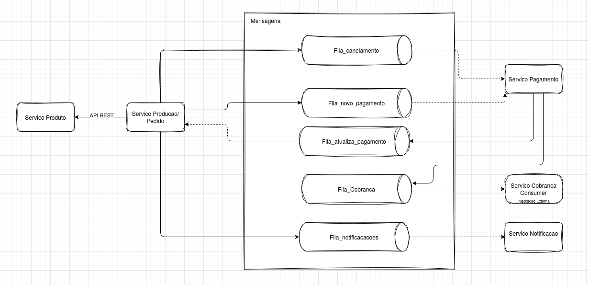
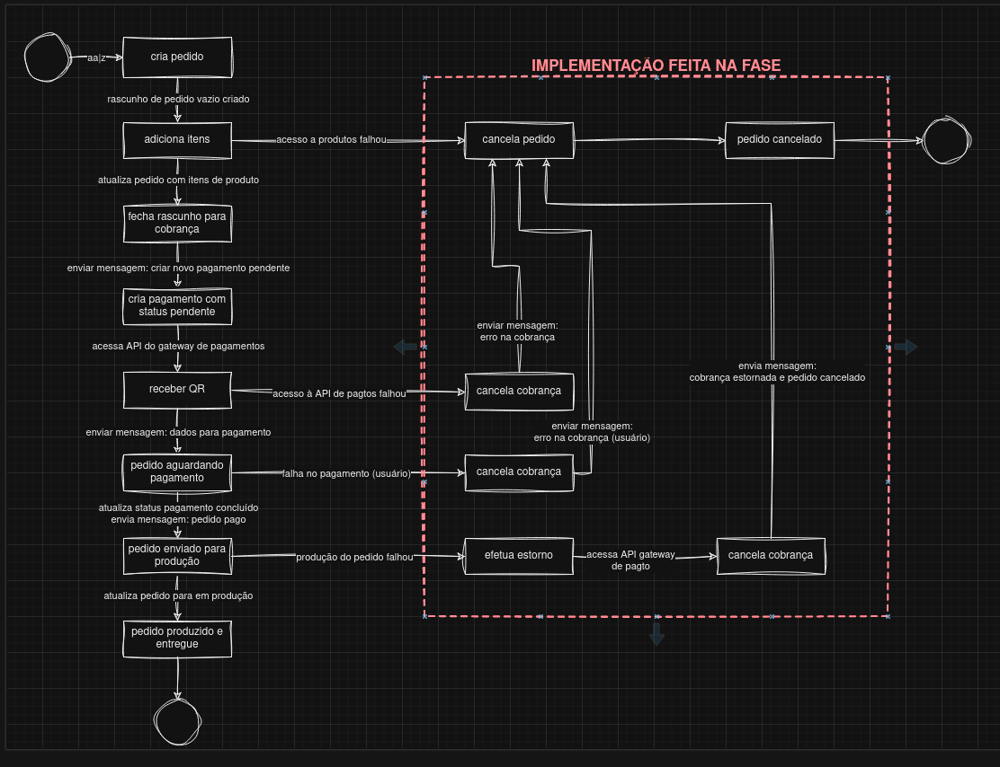

# Tech Challenge - Pós-Tech SOAT - FIAP - Microservico Produto

Este é o projeto desenvolvido durante a fase 5 do curso de pós-graduação em arquitetura de software da FIAP - turma II/2023.

Membros do grupo 30:
Diórgenes Eugênio da Silveira - RM 349116
Elton de Andrade Rodrigues - RM 349353
Gabriel Mendes - RM 348989
Juliana Amoasei dos Reis - RM 348666

## Repositórios

- [Infraestrutura](https://github.com/diorgeneseugenio/fiap-tech-challenge-soat-terraform)
- [Producao](https://github.com/EltonARodrigues/fiap-tech-challenge-soat-producao)
- [Produto](https://github.com/gabrielmendessilva/fiap-tech-challenge-soat-ms-produto)
- [Pagamento](https://github.com/JulianaAmoasei/fiap-tech-challenge-ms-pagamento/tree/main)
- [Autorizacao](https://github.com/JulianaAmoasei/fiap-auth-service-cognito)

### Changelog Fase V:

- **SAGA Coreografada**: Ajustado o projeto para seguir o padrao SAGA do tipo coreografado em todos os Microservicos;
- **LGPD Remocao**: Adicionado API para requisitar a exclusao dos dados pessoais;
- **LGPD Relatorio de impacto**: Adicionado API para relatorio de impacto dos dados pessoais;
- **Refatoração do sistema de infraestrutura** Atualizacoes no deploy AWS e execucao no eks para testes locais;

## SAGA Coreografia

Durante a fase 4 do projeto a separacao do monolito em microservicos seguiu o principio de desacoplamento, permitindo a melhor divisao das tarefas entre os integrantes. Ao avaliar a utilizacao de um orquestrador como SAGA observamos que essa decisão implicaria em um extenso trabalho de refatoração nos microsserviços existentes, mesmo que eles já estejam desacoplados.

### Vantagens Coreografia
Algumas vantagens da Coreografia lenvando em contexto a evolucao e desenvolvimento do nosso projeto durante as fases:

- **Implementação rápida:** A coreografia é mais rápida de implementar, especialmente com um número reduzido de microsserviços e da forma que a separacao seguiu na fase 4.
- **Simplicidade:** Não há necessidade de criar um novo serviço de orquestração, simplificando a arquitetura.
- **Menos etapas:** O fluxo de comunicação é mais direto, envolvendo apenas o microsserviço de pedido/pagamento e a etapa de pagamento.

### Revisão e Criação de Filas:

Para implementar a coreografia, as filas foram revisadas e criadas utilizando o AWS SQS como sistema de mensageria. O processamento das transações internas dos microsserviços também foi revisado e corrigido para evitar que falhas de processamento afetem o fluxo do pedido.

### Resultado:

A coreografia parece ser a opção mais adequada para a fase 5 devido à sua simplicidade, rapidez de implementação e menor quantidade de etapas a serem gerenciadas. 

Estrutura da SAGA Coreografada no projeto:


Distribuicao dos microservicos:


Fluxo da realizacao de um pedido:



### Relatórios OWASP ZAP
Disponibilizado em formato html:
-  [Relatório Inicial](docs/owasp/producao_antes.html)
-  [Relatório Corrigido](docs/owasp/producao_depois.html)

### Relatórios RIPD
-  [RIPD](docs/RIPD.pdf)

## Stack utilizada

- Node.js v20
- TypeScript
- DynamoDB
- Express
- Mongoose
- Docker
- AWS
  - DocumentDB
  - RDS
  - ECS
  - ECR
  - SQS
  - API GATEWAY
  - LOAD BALANCE


## DEPLOY
### Deploy AWS

O projeto é baseado na infraestrutura da AWS, o que requer o provisionamento de recursos e a configuração do deploy. As etapas incluem:

Utilização do repositório de [infraestrutura](https://github.com/diorgeneseugenio/fiap-tech-challenge-soat-terraform) para realizar o deploy do Terraform na AWS.

Após o provisionamento, é necessário configurar os secrets no github Action de cada repositório de microserviço. Isso permite que a cada merge na branch main seja realizado o build, push da imagem no RDS e deploy no ECS. Os procedimentos devem ser executados nos seguintes repositórios:
- [Producao](https://github.com/EltonARodrigues/fiap-tech-challenge-soat-producao)
- [Produto](https://github.com/gabrielmendessilva/fiap-tech-challenge-soat-ms-produto)
- [Pagamento](https://github.com/JulianaAmoasei/fiap-tech-challenge-ms-pagamento/tree/main)
- [Autorizacao](https://github.com/JulianaAmoasei/fiap-auth-service-cognito)

Por fim, dentro do API Gateway criado pelo Terraform, é necessário adicionar a autorização lambda nos endpoints dos microserviços.

### EKS Local
Para o deploy local utilize o repositorio de infra seguindo os passos do EKS + localstack no README.

### Desenvolvimento Localhost

Execute o microservico com o npm e o docker-compose.yml com o localstack + banco de dados para utilizar no desenvolvimento

### Teste Unitario

Teste unitario com JEST:

Comando: `npm run test`


#### Teste BDD

Para os testes de BDD o projeto está utilizando o cucumber presente no diretorio `features`

Comando: `npm run test:bdd`


## Utilizacao

Os projeto cria o metodo de pagamento no banco(QR Code) e as categorias padrão quando iniciado.

### Endpoints

Esta API fornece documentação no padrão OpenAPI.
Os endpoints disponíveis, suas descrições e dados necessários para requisição podem ser consultados e testados em `/api-docs`.

### 2. Pedido

2.1 Crie um pedido vazio usando o `/pedido/iniciar-pedido` passando o id do usuário;
2.2 Adicione um produto ao pedido usando o `/pedido/{id}/adicionar-item`;
A lista de produtos pode ser consultada via GET `/produto`
2.3 Finalize o pedido em `/pedido/realizar-pedido/{id-pedido}` passando o método de pagamento escolhido via body;
No momento existe somente um método disponível, que pode ser consultado via GET `/metodo-pagamento`
Deve ser gerado um id de fatura para ser utilizado no pagamento
2.4 Use POST `/pagamento` para simular o funcionamento do webhook mudando o status de pagamento do pedido para aprovado ou reprovado

**OBS**: Todos os dados necessários para envio das requisições, via parâmetros ou body, estão disponíveis em `/api-docs`.

### 3. Preparo

3.1 Utilize o `/pedido/iniciar-preparo/` para pegar o próximo pedido da fila ou passar o id para furar a fila;
3.2 Utilize o `/pedido/finalizar-preparo/{id}` para marcar como pronto;
3.3 Utilize o `/pedido/entregar-pedido/{id}` para marcar como finalizado;

## Desenvolvimento do projeto

### Diagramas de fluxo

Foram utilizadas técnicas de Domain Driven Design para definição dos fluxos:

- Realização do pedido e pagamento
  

- Preparação e entrega do pedido
  

- Diagrama com a separação dos contextos delimitados
  

### Dicionário

- Cliente: Usuário que faz o pedido;
- Admin: Usuário com permissões de acesso à rotas de gerenciamento das entidades (ex. criação de novos produtos e categorias)
- Produto: É o alimento cadastrado pelo estabelecimento que será disponibilizado para o cliente escolher.
- Categoria: A definição do tipo de Produto
- Pedido: Solicitação realizada pelo cliente que contém itens.
- Itens do Pedido: São os produtos selecionados pelo cliente, e são vinculados a um pedido.
- Cozinha: Equipe que prepara os produtos do pedido.
- Status do Pedido: Em que etapa do processo o pedido se encontra
- Fatura: Registro relativo ao faturamento do pedido, onde detalhamos o meio de pagamento usado.
- Pagamento: Realização do pagamento da fatura de um pedido.
- Status de Pagamento: Identifica o atual estado da fatura, com ele identificamos se o pagamento foi efetuado, ocorreu algum erro, ou ainda não foi processado o pagamento.

### Estrutura do Projeto

O projeto foi reestruturado seguindo o padrão do clean architecture.

- `datasources`: comunicação dos serviços externos como banco de dados e checkout;
- `domain`: contém a camada de domínio da aplicação com suas entidades, casos de uso e repositórios;
- `interfaceAdapters`: camada de interface do clean architecture com o controlador;
- `presenters`: camada externa de comunicacao externa onde se entra a API;

```shell
.
├── src
│   ├── datasources
│   │   ├── authentication
│   │   ├── database
│   │   └── paymentProvider
│   ├── domain
│   │   ├── entities
│   │   ├── repositories
│   │   └── useCases
│   ├── interfaceAdapters
│   │   └── controllers
│   ├── presenters
│   │   └── api
│   └── @types
│       └── express

```

### Domain

Contém a camada de domínio da aplicação e as lógicas de negócio.

```shell
│   ├── domain
│   │   ├── entities
│   │   │   ├── categoria.ts
│   │   │   ├── fatura.ts
│   │   │   ├── ImagemProduto.ts
│   │   │   ├── itemPedido.ts
│   │   │   ├── metodoDePagamento.ts
│   │   │   ├── Pagamento.ts
│   │   │   ├── pedido.ts
│   │   │   ├── produto.ts
│   │   │   ├── types
│   │   │   │   ├── CategoriaType.ts
│   │   │   │   ├── CobrancaType.ts
│   │   │   │   ├── itensPedidoType.ts
│   │   │   │   ├── metodoPagamentoType.ts
│   │   │   │   ├── PagamentoType.ts
│   │   │   │   ├── pedidoService.type.ts
│   │   │   │   ├── pedidoType.ts
│   │   │   │   └── produtoType.ts
│   │   │   └── valueObjects
│   │   │       ├── cpf.ts
│   │   │       └── email.ts
│   │   ├── repositories
│   │   │   ├── authenticationRepository.ts
│   │   │   ├── categoriaRepository.ts
│   │   │   ├── checkoutRepository.ts
│   │   │   ├── faturaRepository.ts
│   │   │   ├── metodoPagamentoRepository.ts
│   │   │   ├── pagamentoRepository.ts
│   │   │   ├── pedidoRepository.ts
│   │   │   └── produtoRepository.ts
│   │   └── useCases
│   │       ├── categoriaUseCase.ts
│   │       ├── faturaUseCase.ts
│   │       ├── metodoPagamentoUseCase.ts
│   │       ├── pagamentoUseCase.ts
│   │       ├── pedidoUseCase.ts
│   │       └── produtoUseCase.ts
```

O diretório `domain` contém as entidades definidoras do negócio, como `usuario`, `pedido` e `categorias` e seus casos de uso. A interface entre a camada de domínio e o restante da aplicação foi definida através do uso de interfaces em `repositories`.

### datasources e presenters

```shell
├── src
│   ├── datasources
│   │   ├── authentication
│   │   │   └── authentication.ts
│   │   ├── database
│   │   │   ├── config
│   │   │   │   ├── db.config.ts
│   │   │   │   └── interfaces
│   │   │   │       └── db.config.interface.ts
│   │   │   ├── models
│   │   │   │   ├── categoriaModel.ts
│   │   │   │   ├── faturaModel.ts
│   │   │   │   ├── index.ts
│   │   │   │   ├── itemPedidoModel.ts
│   │   │   │   ├── metodoDePagamentoModel.ts
│   │   │   │   ├── pagamentoModel.ts
│   │   │   │   ├── pedidoModel.ts
│   │   │   │   ├── produtoImagensModel.ts
│   │   │   │   └── produtoModel.ts
│   │   │   ├── repository
│   │   │   │   ├── categoriaDatabaseRepository.ts
│   │   │   │   ├── faturaDatabaseRepository.ts
│   │   │   │   ├── metodoPagamentoDatabaseRepository.ts
│   │   │   │   ├── pagamentoDatabaseRepository.ts
│   │   │   │   ├── pedidoDatabaseRepository.ts
│   │   │   │   └── produtoDatabaseRepository.ts
│   │   │   └── seeders
│   │   │       ├── cria-categorias.ts
│   │   │       └── cria-metodo-de-pagamento.ts
│   │   └── paymentProvider
│   │       └── checkoutRepository.ts

│   ├── presenters
│   │   └── api
│   │       ├── config
│   │       │   ├── interfaces
│   │       │   │   └── server.config.interface.ts
│   │       │   └── server.config.ts
│   │       ├── index.ts
│   │       ├── middleware
│   │       │   └── auth.ts
│   │       ├── routers
│   │       │   ├── categoriaRouter.ts
│   │       │   ├── index.ts
│   │       │   ├── metodoPagamentoRouter.ts
│   │       │   ├── pagamentoRouter.ts
│   │       │   ├── pedidoRouter.ts
│   │       │   ├── produtoRouter.ts
│   │       │   ├── schemas
│   │       │   │   ├── categoriaRouter.schema.ts
│   │       │   │   ├── metodoPagamentoRouter.schema.ts
│   │       │   │   ├── pagamentoRouter.schema.ts
│   │       │   │   ├── pedidoRouter.schema.ts
│   │       │   │   └── produtoRouter.schema.ts
│   │       │   └── utils.ts
│   │       └── swaggerConfig.ts
```

Nos datasources e presenters foram implementados os métodos necessários para autenticação dos usuários.
